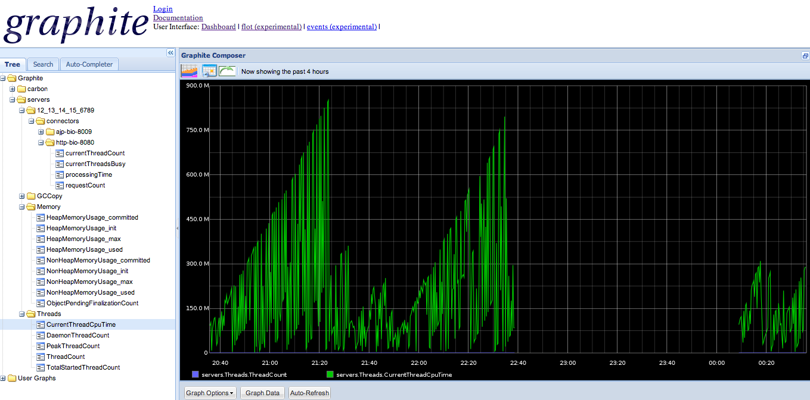

vagrant_graphite_localhost
==================================
 




What is Graphite?

Graphite stores numeric time-series data and renders graphs of this data.  It is one of many tools that you can use for monitoring your jvm's, processes, applications, etc.
There are many plugins that you can use with Graphite, you can even monitor logs by using one of the many plugins available.

If you would like to find out more information about Graphite: 

Read more here http://graphite.readthedocs.org/en/latest/

What does this project provide?

To set up monitoring can be a daunting task.  You first need to set up a collector and in this scenario you will need to set up Graphite.  These are no small tasks by any means.
This project is not meant to be used as a permanent monitoring solution.  If you would like to build out a permanent monitoring solution I would advise that you manually set up
permanent jmxtrans servers and Graphite servers.

So if you don't suggest that this be a permanent solution what is the purpose of this project?

Sometimes you want to monitor your localhost or attach to another instance.  Well if we want a quick solution this is it!!!  There is no way you would manually set up a 
monitoring solution for a dev instance of your app.  But if it was easy why not!!!!

I have Graphite running on docker.  What is docker?

Docker is this awesome tool that lets you pack, ship and run any application as a lightweight container.  

You can read more about Docker here:  https://index.docker.io/u/nickstenning/graphite/

Credit

I got this idea from the following blog

http://blog.docker.io/2013/07/effortless-monitoring-with-collectd-graphite-and-docker/

I am using Nick Stenning's docker-graphite image.

https://index.docker.io/u/nickstenning/graphite/

What is jmxtrans?

To steal from the README file from the jmxtrans.  This is what jmxtrans provides in their own words:

	This is effectively the missing connector between speaking to a JVM via JMX on one end and whatever logging / monitoring / graphing package that you can dream up on the other end.

You can read more about jmxtrans here:
https://github.com/jmxtrans/jmxtrans


================================================================================================================================
One Time Steps
--------------

If you do not have Virtual Box and Vagrant installed please perform the following steps.

The following 2 steps are one time only steps.  Once you have downloaded these items you will not have to do it again.
There are versions for Windows and Mac, for these 2 operating systems your PATH should be set automatically when you install the software.

Download Vagrant from the following site, I am running 1.2.7; so if you are running another version YMMV

http://downloads.vagrantup.com/

If you want to read more about vagrant read here: http://www.vagrantup.com/


Download VirtualBox from the following site, I am running 4.2.16; once again if you are running another version YMMV

https://www.virtualbox.org/wiki/Downloads

VirtualBox is just virtualization software, but if you want to read more about it here you go: https://www.virtualbox.org/

=================================================================================================================================

To start up graphite and jmxtrans do the following

This will create a directory called vagrant_graphite_localhost.  Go into that directory.

Type the following command:

	vagrant up

This will take a bit, depending on your download speed.  I average about 5 minutes using the company's braodband.  At home it can be like 15 minutes.

This process is downloading an Ubuntu box, jmxtrans, docker, and a graphite configured in a docker module, plus some virtual box additions.  After all
these things have downloaded the box will automatically reboot.

Wait a few minutes for the reboot of Ubuntu, then the jmxtrams process, and finally graphite.

Hit localhost:1234 and you should see the Graphite webpage.

Right now this project is meant to work out of the box with the following git project.  This project spins up a tomcat instance, among other things.  You can 
read about it in the followint repo:

	https://github.com/calamq/vagrant_tomcat_starter.git


=================================================================================================================================

Some basic information about jmxtrans
-------------------------------------

This is information about where you can change what server you want to look at or add more things to monitor,etc.

The application is installed in: 

	/usr/share/jmxtrans

Configuration options are stored in: 

	/etc/default/jmxtrans

There is an init script in: 

	/etc/init.d/jmxtrans (this wraps the jmxtrans.sh discussed below)

jmxtrans logs are here
	/usr/share/jmxtrans/logs

Put your .json files into: 

	/var/lib/jmxtrans

The following jsons is what are configured in this download.  You can alter these files to add different types of mbeans to monitor
server_to_poll.json in /var/lib/jmxtrans directory

```json
{
    "servers": [
        {
            "alias": "", 
            "host": "${myserverhost}", 
            "port": "${myserverport}", 
            "queries": [
                {
                    "attr": [
                        "HeapMemoryUsage", 
                        "NonHeapMemoryUsage", 
                        "ObjectPendingFinalizationCount"
                    ], 
                    "obj": "java.lang:type=Memory", 
                    "outputWriters": [
                        {
                            "@class": "com.googlecode.jmxtrans.model.output.GraphiteWriter", 
                            "settings": {
                                "host": "${mygraphitehost}", 
                                "port": "${mygraphiteport}"
                            }
                        }
                    ], 
                    "resultAlias": "Memory"
                }, 
                {
                    "attr": [
                        "DaemonThreadCount", 
                        "PeakThreadCount", 
                        "CurrentThreadCpuTime", 
                        "CurrentTheeadUserTime", 
                        "ThreadCount", 
                        "TotalStartedThreadCount"
                    ], 
                    "obj": "java.lang:type=Threading", 
                    "outputWriters": [
                        {
                            "@class": "com.googlecode.jmxtrans.model.output.GraphiteWriter", 
                            "settings": {
                                "host": "${mygraphitehost}", 
                                "port": "${mygraphiteport}"
                            }
                        }
                    ], 
                    "resultAlias": "Threads"
                }, 
                {
                    "attr": [
                        "CollectionCount", 
                        "CollectionTime"
                    ], 
                    "obj": "java.lang:type=GarbageCollector,name=Copy", 
                    "outputWriters": [
                        {
                            "@class": "com.googlecode.jmxtrans.model.output.GraphiteWriter", 
                            "settings": {
                                "host": "${mygraphitehost}", 
                                "port": "${mygraphiteport}"
                            }
                        }
                    ], 
                    "resultAlias": "GCCopy"
                }
            ]
        }
    ]
}

```


tomcat_to_poll.json in /var/lib/jmxtrans directory

```json
{
  "servers" : [ {
    "port" : "${myserverport}",
    "host" : "${myserverhost}",
    "queries" : [ {
      "outputWriters" : [ {
        "@class" : "com.googlecode.jmxtrans.model.output.GraphiteWriter",
        "settings" : {
          "port" : "${mygraphiteport}",
          "host" : "${mygraphitehost}",
          "typeNames" : [ "name" ]
        }
      } ],
      "obj" : "Catalina:type=ThreadPool,name=*",
      "resultAlias": "connectors",
      "attr" : [ "currentThreadCount", "currentThreadsBusy", "" ]
    },
    {
      "outputWriters" : [ {
        "@class" : "com.googlecode.jmxtrans.model.output.GraphiteWriter",
        "settings" : {
          "port" : "${mygraphiteport}",
          "host" : "${mygraphitehost}",
          "typeNames" : [ "name" ]
        }
      } ],
      "obj" : "Catalina:type=GlobalRequestProcessor,name=*",
      "resultAlias": "connectors",
      "attr" : [ "processingTime", "requestCount", "" ]
    }
 ],
    "numQueryThreads" : 2
  } ]
}
```

add this to the /etc/default/jmxtrans file - 12.13.14.15 is the ip address of the vagrant_localhost project - feel free to point it to whatever instance that has its jmx port exposed

	export JMXTRANS_OPTS="-Dmyserverport=6789 -Dmyserverhost=12.13.14.15 -Dmygraphiteport=2003 -Dmygraphitehost=10.11.12.13"

To run the jmxtrans:

	./jmxtrans.sh start [optional path to one json file]

To stop jmxtrans:

	./jmxtrans.sh stop
	
some graphite set up info for different metrics - json examples

	https://code.google.com/p/jmxtrans/wiki/MoreExamples
	
	
Notes
--------
If you just want to monitor jmx ports then you will be better served using other tools that may be easier to use, such as JConsole or VisualVM.  This tool is better served if you want to start experimenting with collectd, logster. logstash, etc.

